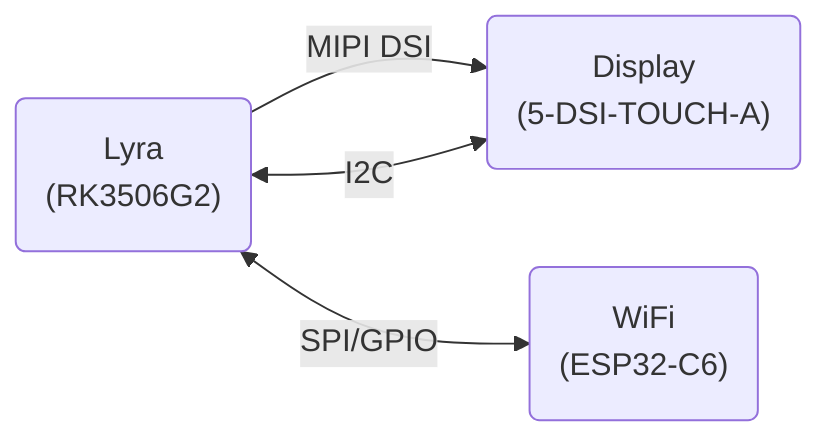

# Yocto Layer for Power Window

Yocto layer for the Luckfox Lyra base board used together with an ESP32-C6 (with ESP_Hosted_NG) and a 5inch LCD touch display from waveshare.

This layer includes the Power Window Application and it's dependencies and provides all tweaks and additions needed to make use of all hardware components.

## Hardware

- **Main Board:** Luckfox Lyra
  - **SoC:** Rockchip RK3506G2 (3x Cortex-A7 + Cortex-M0, 32-bit ARMv7-A + NEON)
  - **RAM:** 128MB DDR3L
  - **Storage:** External TF/SD Card
- **WiFi Board:** Espressif ESP32-C6 Eval Board
  - **SoC:** RISC-V 32-bit
  - **RAM:** 512KB SRAM
  - **STORAGE:** 8MB Flash
- **Display:** Waveshare 5-DSI-TOUCH-A
  - **Size:** 5 inch
  - **Resolution:** 720 x 1280

### Hardware Block Diagram



### Hardware Connection Overview

#### ESP32-C6 WiFi module

| Function   | ESP32-C6 | Lyra |
| :--:       | :--: | :--:     |
| SLCK       | IO6  | GPIO0_A7 |
| MISO       | IO2  | GPIO0_A5 |
| MOSI       | IO7  | GPIO0_A6 |
| CS0        | IO10 | GPIO0_A4 |
| Handshake  | IO3  | GPIO0_B2 |
| Data Ready | IO4  | GPIO0_B1 |
| Reset      | RST  | GPIO0_B0 |

#### 5-DSI-TOUCH-A display

The display is connected via MIPI DSI interface connector to the Lyra board.
Additionally, the display's power supply is connected ti Lyra's USB2.0 HOST connector.

## Prerequirements

- kas

```bash
sudo apt install kas
```

## Install

1. Clone this layer repository

```bash
git clone https://github.com/LarsGoerner/power-window-distro.git
cd power-window-distro
```

2. Build with kas

```bash
kas build kas-project.yml
```

3. Create package index files for opkg updates

```bash
kas shell kas-project.yml -c "bitbake package-index"
cp -r build/tmp-glibc/deploy/ipk/* <UPDATE PACKAGES DIR>
```

## Current Status

- [x] Basic OS Setup
- [ ] App
  - [x] Settings
    - [ ] Display settings
      - [x] Brightness
      - [ ] Power saver options
      - [ ] App style settings
    - [x] WiFi settings
    - [x] Update control
    - [x] Power account settings
    - [ ] Settings presentation
  - [x] Weather feature
    - [x] Weather data Fetch
    - [x] Environmental sensors
      - [x] Add DHT11
    - [ ] Weather data presentation
      - [ ] Current weather/Environmental data view
      - [ ] Weather forecast view
  - [ ] Power data feature
    - [x] Power data fetch
    - [ ] Power data presentation

## Write SD Card

1. Connect SD Card

2. Write the SD Card

```bash
# Un-mount partitions
sudo udisksctl unmount -b /dev/sdc1
sudo udisksctl unmount -b /dev/sdc2

# Write new image
sudo dd if=power-window-image-power-window.rootfs.wic if=/dev/sdc bs=4096 status=progress
sudo sync

# Detach SD card
sudo udisksctl power-off -b /dev/sdc
```

## Create a patch file

1. Apply the change

2. Commit changes

```bash
git add <changed file(s)>
git commit -m "<commit message>"
```

> The *commit message* will also be part of the patch name
> later (xxxx-<commit-message>.patch)

3. Create patch from latest commit

```bash
git format-patch HEAD~1
```

## Change the root PSK

To change the the password for the root user the *ROOT_PASSWORD* variable can be
used in local.conf.
```ini
ROOT_PASSWORD = "<PLAIN-TEXT-PASSWORD>"
```

Alternatively the ROOT_PASSWORD_HASH can be used instead for a pre-hashed password.
```ini
ROOT_PASSWORD_HASH = "<HASHED-PASSWORD>"
```

## Usefull Links

[ESP_Hosted_NG](https://github.com/espressif/esp-hosted/blob/master/esp_hosted_ng/docs/setup.md)

[Luckfox Lyra](https://wiki.luckfox.com/Luckfox-Lyra/)

Based on meta-rockchip-rk3506 found in [luckfox-lyra-ultra-yocto](https://github.com/OOHehir/luckfox-lyra-ultra-yocto/tree/main)